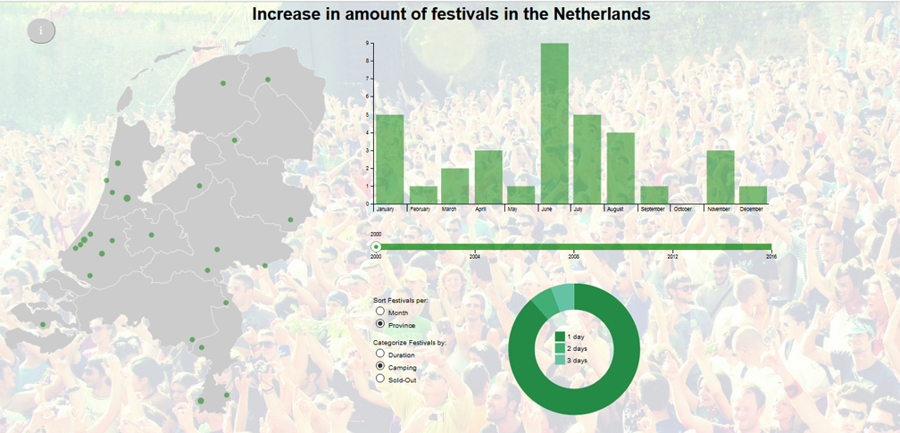

# Data visualisatie over de toename van festivals in Nederland

## Doel

Het aantal festivals in Nederland groeit enorm sinds de afgelopen aantal jaren. Deze visualisatie laat het aantal festivals zien dat er in een bepaald jaar zijn gehouden. Met een tijdlijn zal er gekeken kunnen worden naar de jaren 2000 t/m 2016 en op die manier is te zien dat het aantal festivals is toegenomen door de jaren heen.

## Overzicht visualisatie

## Acknowledgements

De dataset is verkregen door per maand te scrapen van de site http://www.festivalinfo.nl/festivals/

© 2017 Lars Overwater No Rights Reserved
