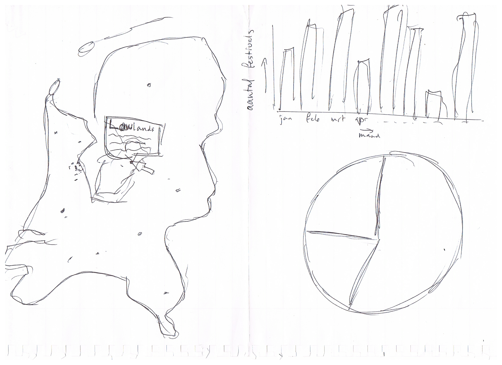

# Programmeer Project

Data visualisatie over de toename van festivals in Nederland

## Verhaal

Het aantal festivals in Nederland groeit enorm sinds de afgelopen aantal jaren. Deze visualisatie laat het aantal festivals zien dat er in een bepaald jaar gehouden worden. Met een tijdlijn zal er gekeken kunnen worden naar de jaren 2000 t/m 2016.

## Dataset

De dataset kan worden verkregen door per maand te scrapen van de site http://www.festivalinfo.nl/festivals/

## Minimum viable product

Aan de linkerkant staat er op de kaart van Nederland van een bepaald jaar de posities aangegeven waar festivals werden gehouden dat jaar. Rechtsboven zal er een staafdiagram te zien zijn met het aantal festivals in Nederland per maand. En rechtsonder zal een cirkeldiagram aangeven welk percentage van alle festivals een bepaald aantal dagen duurt. Met een slider zal het jaar kunnen worden veranderd. En wanneer er over een festival gehoverd wordt zal een popup meer info geven over het evenement.

## Optionele implementatie

### Automatische slider

Met een play button zou automatisch de slider kunnen gaan lopen waardoor het duidelijk te zien is dat het aantal festivals toeneemt. Dit zou nog duidelijker kunnen door de nieuwe festivals groen te maken.

### Selecties

Er zou ook gewerkt kunnen worden met selecties. Bijvoorbeeld dat er alleen gekeken wordt naar het aantal festivals in Drenthe of naar die festivals die meer dan 1 dag duren.

### Verandering cirkeldiagram

Het aantal dagen dat een festival duurt is makkelijk te scrapen, echter het zou voor de visualisatie mooier zijn om hier een onderscheid van de verschillende muzieksoorten te kunnen maken.

Of als het mogelijk is ook hier selecties op toepassen, zodat je kan switchen tussen de weergave van de duur van een festival, muzieksoort en bijvoorbeeld gratis entree of niet.

### Extra interactie

Door op een festival te klikken zou je een geschiedenis kunnen laten zien. Bijvoorbeeld in het bezoekersaantal door de jaren heen of de ticketprijs per jaar. Ticketprijs is hierbij nog wel goed op te zoeken, bezoekersaantal is echter niet voor alle evenementen inzichtelijk.

## Onderdelen

### Noodzakelijk

* Data scrapen en op een handige manier opslaan.
* SVG map van Nederland implementeren (al gevonden)
* Festivals op de juiste positie op de map plaatsen.
* Staafdiagram maken.
* Cirkeldiagram maken.
* Met slider visualisatie updaten.
* Achtergrondinformatie van festivals weergeven.
  * Bij hover een popup met korte omschrijving.

### Optioneel

* Meerdere festivals op dezelfde positie duidelijk maken.
* Afspeelknop voor automatische weergave.
* Bij het jaar 2000 duidelijk maken wanneer festivals zijn opgericht.
* Achtergrondinformatie van festivals weergeven.
  * Trendlijn van bezoekersaantal/ticketprijs.
* Selecties maken op basis van:
  * Grootte festival
  * Provincie
  * Kosten festival
  * Soort muziek
  * Duur festival
