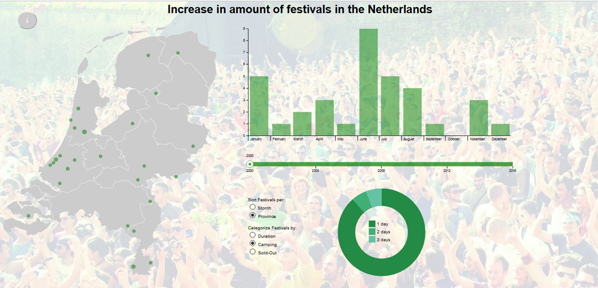

# Report

## Omschrijving Programma

De visualisatie laat het aantal festivals zien dat er in een bepaald jaar zijn gehouden. Festivals worden per plaats op een map van Nederland geprojecteerd, per maand of provincie weergegeven in een barchart en onder verschillende categorieen verdeeld in een piechart. Daarnaast zijn er een infoknop, selectie mogelijkheden voor de barchart en piechart en een slider voor een overzicht door de jaren heen.

## Specificatie Onderdelen

### Map van Nederland

Een SVG map van Nederland is ingeladen als achtergrond van een svg element. In dit svg element worden vervolgens per plaats met minstens 1 festival een cirkel geplaatst. Hoe meer festivals, hoe groter de cirkel. Het plaatsen gebeurt via een projectie, aangezien er data aanwezig is met latitude en longitude, maar er is een x en y positie van nodig. Het plaatsen van de cirkels gebeurt in volgorde van plaats met meeste festivals naar plaats met minste festivals. Bij het switchen naar een ander jaar worden eerst alle oude cirkels verwijderd en vervolgens de nieuwe aangemaakt.

De cirkels hebben drie eventlisteners:
* On mouseover verschijnt er een tooltip dat de plaatsnaam en het aantal festivals weergeeft. Met css style :hover wordt de kleur van de cirkel veranderd.
* On mouseout verdwijnt deze tooltip.
* On click verschijnt er een andere tooltip die de namen weergeeft van alle festivals die er op die plaats zijn gehouden dat jaar. De hoogte van deze tooltip schaalt tot een bepaalde grootte bij en is bij een lange festivallijst scrollbaar zodat alle festivals zichtbaar zijn. Deze tooltip verdwijnt wanneer er ergens wordt geklikt dan op deze tooltip.

### Barchart

De barchart geeft het aantal festivals weer per maand of per provincie (zie kopje Selecties). Doordat bij het switchen naar een ander jaar eerst de oude barchart wordt verwijderd en vervolgens een nieuwe wordt gemaakt is de y-as altijd bijgeschaald. De x-as is voor provincies ordinal en voor maanden geschaald met d3.time.months. Noord-Holland, Zuid-Holland en Noord-Brabant zijn weergegeven als N-Holland, Z-Holland en N-Brabant.

Ook de bars hebben drie eventlisteners:
* On mouseover verschijnt er een tooltip dat de maand of provincie en het aantal festivals weergeeft. Met css style :hover wordt de kleur van de bar veranderd.
* On mouseout verdwijnt deze tooltip.
* On click wordt de piechart geupdate met enkel waardes van de geselecteerde maand of provincie. Deze selectie blijft tot een andere bar wordt geselecteerd, de bar gedeselecteerd wordt door nog een keer op te klikken of door het jaar te veranderen. De selectie is duidelijk gemaakt met een zwarte omlijning.

### Piechart

De piechart verdeelt het aantal festivals per categorie (zie kopje Selecties). In het midden van de piechart staat een legenda.

De arcs hebben twee eventlisteners:
* On mouseover verschijnt er een tooltip dat de categorie en het aantal festivals weergeeft.
* On mouseout verdwijnt deze tooltip.

### Slider

Met de slider wordt er geswitcht van jaar. Iedere keer dat er gesleept wordt met de slider is er een directe verandering te zien in de map, piechart en barchart.

### Selecties

Voor de barchart is er de keuze tussen maanden en provincies. En voor de piechart kan er gekozen worden voor 3 categorieen: duur van het festival, of een het camping had en of het uitverkocht was. Ddoor een selectie verandert de desbetreffende chart direct.

### Infoknop

Door op de infoknop te klikken linksbovenin wordt een geplaatste div naar de voorgrond gehaald. Deze div heeft als achtergrond tekst en plaatjes die het gebruik van de visualisatie uitleggen. Door op de div te klikken gaat deze weer terug naar de achtergrond.

## Uitdagingen

De site was niet dusdanig consistent dat een groot gedeelte van de tijd nodig was om de gescrapete dataset te perfectioneren. Voorbeelden zijn hoofdlettergevoeligheden, meerdere plaatsen bij een festival, andere naam voor plaatsnaam, etc. De dataset is nu wel volledig en bruikbaar.

Wanneer de map als svg element werd gebruikt, bleef op de voorgrond en was niet met functies of z-index naar achter te brengen. De map wordt nu als achtergrond gebruikt, aangezien het voor het product enkel nodig was om de cirkels op de juiste positie te plaatsen

Grotere cirkels stonden soms boven de kleinere cirkels waardoor deze niet te bereiken waren. Het plaatsen van de cirkels gebeurt daarom nu in volgorde van plaats met meeste festivals naar plaats met minste festivals.

Door eerst te scrapen en later meer categorieen te willen voor mijn data heeft het wat tijd gekost data goed te verkrijgen. Door gebruik van filter, nest en map is alle data uiteindelijk verkregen.

## Veranderingen

Achtergrondinformatie van festivals was lastig bij ieder festival te achterhalen (Denk aan ticketprijs en bezoekersaantal). Vandaar dat dit deze informatie er niet in zit. Wel was er data over de duur, of het een camping en of het uitverkocht was.

Aan de afspeelknop is niet toegekomen. De vraag is wel in hoe verre dat mooi bij de visualisatie staat als er maar 17 waardes voor de jaren zijn.  

## Design keuzes

Er was data aanwezig van tot wel 1998. Toch is gekozen om vanaf 2000 beginnen, aangezien dit een mooi rond getal is en vanaf daar de data compleet lijkt te zijn.

In plaats van met transparantie van de cirkels werken is er gewerkt met de grootte van de cirkels om het aantal festivals weer te geven. Zo is het duidelijker zichtbaar of er data van aanwezig is en hoe het aantal festivals toeneemt. Transparantie wordt nu gebruikt zodat kleinere cirkels in grotere cirkels zichtbaar zijn.

## Reflectie

Ik ben zeer tevreden met het uiteindelijke project. Het was ook een onderwerp wat me al heel erg interesseerde en ik vond het heel mooi om te zien hoe een idee door de weken heen al heel snel vorm kan krijgen. Het meest heb ik geleerd van hoe json arrays en objecten precies werken en aangeroepen moeten worden. En daarbij hoe belangrijk het is in het begin al duidelijk te hebben hoe je je dataset moet indelen.

Toch zijn er natuurlijk een aantal punten die ik graag nog geimplementeerd zie:

### Gemakkelijk

* Bij het herladen van de pagina blijven de radiobuttons soms op een eerder geselecteerde knop staan, terwijl data geladen wordt van een andere categorie. Mooi zou zijn om de knoppen te kunnen resetten. Dit was nu niet echt nodig aangezien bij het openen van de pagina het wel goed staat en er verder geen reden is om de pagina te herladen.
* De piechart ook linken aan de barchart, zodat per maand of provincie het aantal festivals van een bepaalde categorie te zien is. Misschien zelfs doorlinken naar de cirkels op de map.

### Lastig

* Een automatische scraper die bij een nieuw jaar de data gelijk toevoegt.
* Meer data achterhalen van festivals (soort festival, ticketprijs, bezoekersaantal, hoofd-acts, etc.)
* Doorlinken naar webpagina van het festival (lastig omdat deze vaak ieder jaar veranderen)
